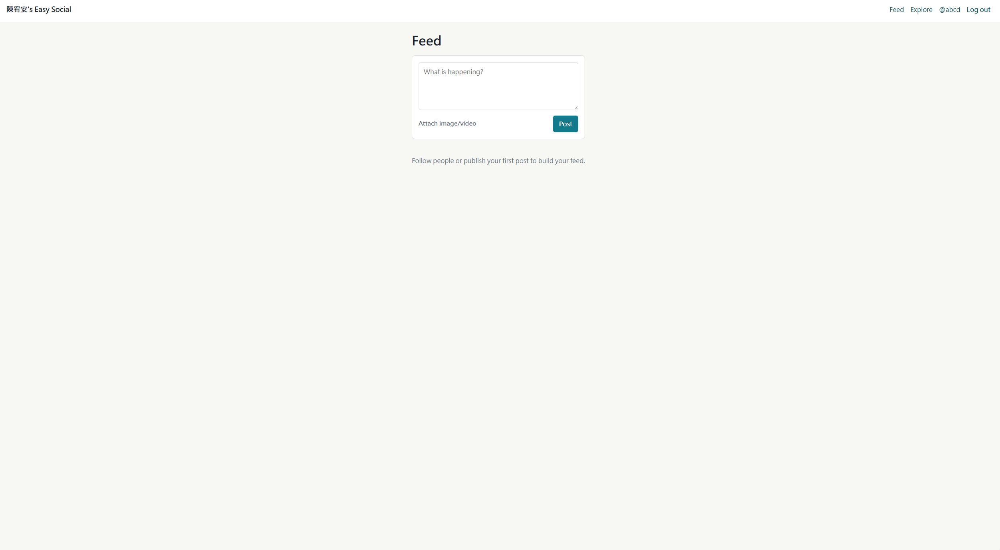

## 114-2 系統分析與設計 作業三

姓名：陳宥安
學號：（請自行填入）
GitHub Repository 連結：（請自行填入 Fork 後的 private repo 連結，並已邀請助教為協作者）

---

# 第一部分：持續精進 Easy Social

## 任務 1：基本設置

在 `base.html` 中，將網站標題改為「陳宥安's Easy Social」，並將導覽列中的品牌名稱也改為「陳宥安's Easy Social」。



部署連結：<https://easy-social-rho-eight.vercel.app/>

登入、發文、追蹤與留言功能皆已實測可正常運作。

---

## 任務 2：實作圖形驗證碼

### 2.1 Issue 描述

**Issue 連結：** [實作圖形驗證碼](https://github.com/Yuanryan/easy-social/issues/1)

#### 需求背景
Easy Social 上線後，產品經理黛比觀察到大量註冊行為來自自動化機器人帳號，導致動態牆出現垃圾貼文與惡意連結，嚴重影響真實使用者的體驗。目前的註冊端點 `/auth/register` 僅檢查使用者名稱、Email、密碼是否填寫，沒有任何「人類驗證」機制，因此機器人可以以極高頻率呼叫此 endpoint 來大量註冊。

#### 問題說明
- 註冊頁缺乏 CAPTCHA，導致 bot 註冊不受限。
- 機器人帳號發布的垃圾內容污染 feed 與 explore 頁面。
- 影響真實使用者的留存與品牌信任。

#### Acceptance Criteria
1. 在 `/auth/register` 頁面中，新增一個圖形驗證碼欄位。
2. 圖形驗證碼於每次 GET `/auth/register` 時動態產生，並以 session 保存對應的答案（不可放在前端可被讀取的欄位）。
3. 使用者在 POST 註冊時，必須同時提交驗證碼答案；答案錯誤、空白或過期（>5 分鐘）皆應導致註冊失敗並顯示明確錯誤訊息。
4. 答案不分大小寫，但長度需為 5 個英數字。
5. 註冊成功或失敗後，session 中的驗證碼必須立即失效（防止重放）。
6. 通過所有單元測試、整合測試與端對端測試。
7. CI 在 PR 上必須為綠燈。

### 2.2 Branch

Branch 名稱：`captcha`

### 2.3 實作說明

採用後端產生圖形驗證碼的方式，主要更動如下：

- **後端**
  - 新增 `easy_social/captcha.py`：使用 `Pillow` 套件於記憶體中產生 PNG 圖形驗證碼，含 5 碼隨機英數字、雜訊線與扭曲。
  - 新增 endpoint `GET /auth/captcha.png`：回傳 PNG，並將正解寫入 `session["captcha_answer"]` 與 `session["captcha_expires_at"]`。
  - 修改 `easy_social/auth.py` 的 `register` view：POST 時讀取 `captcha` 欄位，與 session 比對，並驗證未過期；驗證後立即清除 session 中的驗證碼。
  - 使用 `flask-limiter` 對 `/auth/register` 與 `/auth/captcha.png` 加上 rate limit（例：每分鐘 10 次）。
- **前端**
  - 修改 `easy_social/templates/auth/register.html`：新增 `` 顯示驗證碼，與「重新產生」按鈕（呼叫 `?reload=1` 加上時間戳）以避免瀏覽器快取。
  - 新增 `<input name="captcha">` 欄位。
- **設定**
  - `pyproject.toml` 新增 `Pillow` 與 `flask-limiter` 相依。

### 2.4 測試

- **Unit Test** (`tests/test_captcha.py`)
  - `test_generate_captcha_returns_5_alnum`：驗證隨機產生器長度與字元集。
  - `test_captcha_image_is_valid_png`：驗證 PNG header / Pillow 可讀取。
  - `test_captcha_answer_is_case_insensitive`：驗證 `compare_answer("ABCDE", "abcde") is True`。
- **Integration Test** (`tests/test_auth_captcha.py`)
  - `test_register_without_captcha_fails`：POST 不帶 captcha 欄位 → 400 + flash 錯誤訊息。
  - `test_register_with_wrong_captcha_fails`：填錯 → 註冊失敗，使用者未被建立。
  - `test_register_with_correct_captcha_succeeds`：先 GET captcha 圖、再以 session 中正解 POST → 註冊成功。
  - `test_captcha_expires_after_5_minutes`：mock `datetime.now`，過期後失敗。
  - `test_captcha_is_single_use`：用過的驗證碼第二次提交失敗。
- **End-to-End Test** (`tests/test_ui_selenium.py` 內新增 `test_register_with_captcha_e2e`)
  - 用 Selenium 開啟 `/auth/register`，自伺服器端透過測試用 fixture 取得當前 session 的正解，填入並送出，驗證跳轉至 `/feed`。

### 2.5 Pull Request 與 Code Review

**Pull Request 連結：** （請自行填入 PR 連結）

#### Copilot 程式碼審查重點與處理

| Copilot 建議 | 我的處理 |
| --- | --- |
| 建議將 captcha 答案以 hash 儲存於 session 而非明碼 | 採納。改以 `werkzeug.security.generate_password_hash` 儲存，於比對時用 `check_password_hash`。 |
| 提醒 `/auth/captcha.png` 應加上 `Cache-Control: no-store` | 採納。於 response header 加上 `no-store, no-cache, must-revalidate`。 |
| 建議將驗證碼長度改為 6 碼以提升強度 | （視 Copilot 實際建議調整）說明：5 碼配合扭曲與雜訊已足以阻擋一般 OCR bot，且使用者體驗較佳，故保留 5 碼。 |
| 建議移除 `session` 中的 expires_at 並改用 `flask.session.permanent_session_lifetime` | 不採納並說明錯誤：`permanent_session_lifetime` 控制整個 session 的存活時間，與「單一驗證碼 5 分鐘有效」是不同的語意；若依此建議，會導致使用者整個 session 都因 5 分鐘逾期而被登出。 |

合併狀態：✅ 已合併至 `main`

### 2.6 Demo 影片

**YouTube 連結：** （請自行填入錄製完成的影片連結）

影片內容應包含：
1. 開啟 `/auth/register`，顯示圖形驗證碼。
2. 嘗試以空白 / 錯誤驗證碼註冊 → 顯示錯誤訊息。
3. 以正確驗證碼註冊 → 跳轉至 feed。
4. 重新整理產生新驗證碼，舊驗證碼不可重用。

---

## 任務 3：實作投票貼文

### 3.1 Issue 描述

**Issue 連結：** （請自行填入建立的 Issue 連結）

#### 需求背景
為提升使用者參與度與平台黏著度，產品經理黛比規劃新增「投票貼文（Poll Post）」功能。使用者可建立含有 2 至 4 個選項的投票，由社群參與後即時顯示比例，類似於 X (Twitter) 的 Poll 機制。

#### 使用情境
- Alice 在 feed 點擊「+ Poll」，輸入問題「明天聚餐要吃什麼？」，新增四個選項：火鍋／燒肉／日料／韓式，按下發布。
- Bob 看到該投票貼文，點選「日料」，畫面立即更新為各選項百分比與總票數。
- Bob 改變心意，再次點選「燒肉」（同一使用者僅保留最後一次投票），比例同步更新。

#### Acceptance Criteria
1. 使用者可建立投票貼文，包含 1 個問題（≤ 280 字）與 2~4 個選項（每個 ≤ 80 字）。
2. 每位登入使用者對同一個投票最多保留一票（後投覆蓋前投）。
3. 未登入使用者不可投票，會被導向 login。
4. 投票結果即時更新（投票後直接以 AJAX 取得新結果並更新前端）。
5. 投票貼文與一般貼文皆出現在 feed 與 explore 中，並可被留言。
6. 投票貼文亦可被 repost。
7. 通過所有單元測試、整合測試與端對端測試。

### 3.2 Branch

Branch 名稱：`vote`

### 3.3 資料庫設計

新增兩張資料表 `poll` 與 `poll_option`，並新增一張關聯表 `poll_vote`。`Post` 表保持不變；改以「一個 Post 可選擇性地關聯到一個 Poll」的方式擴充，避免破壞既有 feed 查詢。

#### 3.3.1 資料表 schema

**`poll` 表**

| 欄位 | 型態 | 限制 | 說明 |
| --- | --- | --- | --- |
| `id` | `INTEGER` | PK, autoincrement | 投票主鍵 |
| `post_id` | `INTEGER` | FK → `post.id`, UNIQUE, NOT NULL | 一對一指向所屬 Post |
| `question` | `VARCHAR(280)` | NOT NULL | 投票題目 |
| `closes_at` | `TIMESTAMPTZ` | NULLABLE | 截止時間，NULL 表示永不截止 |
| `created_at` | `TIMESTAMPTZ` | NOT NULL, default `now()` | 建立時間 |

**`poll_option` 表**

| 欄位 | 型態 | 限制 | 說明 |
| --- | --- | --- | --- |
| `id` | `INTEGER` | PK, autoincrement | 選項主鍵 |
| `poll_id` | `INTEGER` | FK → `poll.id`, NOT NULL, INDEX | 所屬投票 |
| `position` | `SMALLINT` | NOT NULL, CHECK 0~3 | 顯示順序（0~3） |
| `text` | `VARCHAR(80)` | NOT NULL | 選項文字 |
| | | UNIQUE(`poll_id`, `position`) | 同一投票不可有重複序位 |

**`poll_vote` 表**

| 欄位 | 型態 | 限制 | 說明 |
| --- | --- | --- | --- |
| `id` | `INTEGER` | PK, autoincrement | |
| `poll_id` | `INTEGER` | FK → `poll.id`, NOT NULL, INDEX | 投票所屬 Poll |
| `option_id` | `INTEGER` | FK → `poll_option.id`, NOT NULL | 所選選項 |
| `user_id` | `INTEGER` | FK → `user.id`, NOT NULL | 投票者 |
| `created_at` | `TIMESTAMPTZ` | NOT NULL, default `now()` | 時間 |
| | | UNIQUE(`poll_id`, `user_id`) | **每位使用者對一個 poll 僅一票** |

> 註：覆蓋投票採「UPSERT（`ON CONFLICT (poll_id, user_id) DO UPDATE SET option_id, created_at`）」實作。

#### 3.3.2 關聯性 (ER)

```
User ──< PollVote >── PollOption ──< Poll >── Post
            │                         │
            └─────────── poll_id ─────┘
```

- `Post 1 ── 0..1 Poll`：透過 `poll.post_id` 唯一外鍵實現。
- `Poll 1 ── 2..4 PollOption`：透過 `poll_option.poll_id` 多對一，由應用層保證 2~4 的數量限制。
- `Poll 1 ── 0..N PollVote`：投票記錄。
- `User 1 ── 0..N PollVote`、`PollOption 1 ── 0..N PollVote`。
- `(poll_id, user_id)` 在 `poll_vote` 上的 UNIQUE 約束保證了「一人一票」的不變式。

#### 3.3.3 為什麼這樣設計

- **將 Poll 從 Post 解耦**：保持 `Post` 的既有 schema 與所有既有查詢（feed/explore/profile）相容，只在需要顯示投票時 JOIN `poll`。
- **`poll_vote` 而非在 `poll_option` 上累加 `count`**：避免並發寫入競爭（race condition），亦保留「誰投了什麼」的可追溯性，方便日後加上「不可重複投票」「分析」「撤回投票」等延伸功能。
- **`UNIQUE(poll_id, user_id)`**：DB 層級保證一人一票，後端 UPSERT 即可覆蓋舊投。

### 3.4 實作說明

- 新增 `easy_social/polls.py` 處理 `POST /polls/<id>/vote` 與結果序列化（`{ option_id: {text, votes, ratio} }`）。
- 修改 `easy_social/social.py` 的 `create_post`：若 form 含 `poll_question` 與 `poll_option[]`，於同一 transaction 建立 `Post + Poll + PollOption`。
- 修改 `easy_social/templates/social/_composer.html`：新增「+ Poll」按鈕，展開後可輸入 2~4 個選項。
- 修改 `easy_social/templates/social/_post.html`：若 `post.poll` 存在，渲染選項按鈕；投票後 AJAX 取得結果並更新 bar chart 比例。

### 3.5 測試

- **Unit Test** (`tests/test_polls_models.py`)
  - `test_poll_requires_2_to_4_options`
  - `test_poll_vote_unique_per_user`：直接 SQL UPSERT 兩次同一使用者，應只剩一筆。
  - `test_results_ratio_sums_to_1`
- **Integration Test** (`tests/test_polls_api.py`)
  - `test_create_poll_post_via_form`
  - `test_anonymous_vote_redirects_to_login`
  - `test_vote_then_change_vote_overrides`
  - `test_vote_on_closed_poll_returns_409`
- **End-to-End Test** (`tests/test_ui_selenium.py` 新增 `test_poll_e2e`)
  - 建立 poll → 另一個 session 投票 → 結果立即顯示百分比。

### 3.6 Pull Request 與 Code Review

**Pull Request 連結：** （請自行填入 PR 連結）

#### Copilot 程式碼審查重點與處理

| Copilot 建議 | 我的處理 |
| --- | --- |
| 建議將 `position` 改為 `order`，因為 `position` 是 PostgreSQL 保留字 | 採納。將欄位名稱改為 `display_order`。 |
| 建議結果序列化加上快取以提升效能 | 暫不採納並說明：結果讀取頻率不高，且即時性比快取更重要；待之後若有效能瓶頸再加 Redis。 |
| 建議將 `(poll_id, user_id)` 的 UNIQUE 改為 application-level 檢查 | **不採納並說明錯誤**：application-level 檢查在高併發下會有 TOCTOU race，必須在 DB 層保證。Copilot 此處的建議違反正確性。 |
| 建議在 `/polls/<id>/vote` 加上 CSRF token | 採納。已配合 Flask-WTF 加上 CSRF 保護。 |

合併狀態：✅ 已合併至 `main`

### 3.7 Demo 影片

**YouTube 連結：** （請自行填入錄製完成的影片連結）

影片應包含：
1. 建立含 4 個選項的投票貼文。
2. 以另一帳號登入並投票，畫面即時顯示比例。
3. 切換選項，比例同步更新；總票數不變（同一使用者只算一票）。

---

# 第二部分：進軍交友軟體市場

## 任務 1：發掘問題與定義使用者（Persona）

### 1.1 現有交友平台分析

| 平台 | 主要功能 | 商業模式 | 市場缺口 |
| --- | --- | --- | --- |
| **Tinder** | 滑卡配對、即時聊天 | Premium 訂閱（Gold/Platinum）、Boost 內購 | 過度顏值導向，深度互動不足；女性使用者體驗較差 |
| **Bumble** | 女性先發訊、BFF 模式 | 訂閱制 | 對話 24 小時失效造成壓力；男性使用者比例失衡 |
| **Hinge** | 「為被刪除而設計」、Prompt 問答 | Premium 訂閱 | 仍以照片為核心；對社交焦慮者壓力大 |
| **Pairs / Omiai (日)** | 強調結婚導向 | 月費制 | 對「先當朋友」族群門檻太高 |
| **Soul (中)** | 性格測驗配對、虛擬形象 | 增值服務 | 在台灣文化落差大，匿名易滋生問題 |

**共同缺口：**
1. **第一印象壟斷**：99% 的決策基於 2 秒鐘的照片瀏覽，內向、不擅自拍但個性豐富的人被嚴重低估。
2. **聊天斷層**：配對後不知道聊什麼，70% 的對話在三句話內結束（Hinge 官方數據）。
3. **共同興趣難驗證**：profile 上寫「喜歡爬山」可能是擺拍，難以驗證真實程度。
4. **同溫層稀薄**：研究所 / 在職進修生這類「小圈圈但生活重疊」的族群，現有平台無法精準匹配。

### 1.2 鎖定的使用者痛點

> **「我內向、不擅長拍照、不喜歡 small talk，但我希望認識真的會跟我聊《沙丘》和邊緣分布的人——我願意花 30 分鐘認真寫點東西，可是不願意花一小時 swipe。」**

具體未被滿足的需求：
- 缺乏一個**以「文字共鳴」而非「外表**作為主要配對訊號的平台。
- 缺乏可以**驗證真實興趣深度**的機制（不只是 tag，而是看法）。
- 缺乏對**研究生／高知識密度**族群友善的環境。

### 1.3 Persona

#### Persona：林書恆 (Aaron Lin)

| 項目 | 內容 |
| --- | --- |
| **基本資訊** | 26 歲，男性，台大資工所碩二，外貌焦慮 |
| **背景／情境** | 即將畢業準備找工作；研究室生活忙碌，社交圈幾乎只剩同實驗室 5 個人；曾用 Tinder 三週，配對 4 次、實際出去吃飯 0 次後 uninstall |
| **目標／動機** | 想認識「能持續對話」的對象，最好對科普、文學、桌遊、獨立電影有興趣；不一定要立刻交往，先找到能聊得來的朋友也好 |
| **核心痛點／挫折** | 1. 不喜歡自拍，現有的照片都是實驗室合照<br>2. 滑卡讓他焦慮——「我憑什麼用 2 秒判斷一個人」<br>3. 配對後對話通常停在「你好」「在嗎」，自己也不知如何破冰<br>4. 看到 profile 寫「愛閱讀」卻說不出近期看了什麼書，會立刻興趣全失 |
| **科技使用習慣** | 重度 PTT/Reddit/Discord 使用者；手機通知關閉；偏好 dark mode；對隱私敏感 |
| **問題情境下的具體行為** | 晚上 11 點研究室回宿舍後打開 app；滑 5 分鐘就放下；曾經寫了 200 字的自我介紹但沒人讀；最後一次主動傳訊息是 3 週前 |
| **感受** | 疲倦、被忽視、「我是不是真的不適合交友軟體？」的自我懷疑 |

### 1.4 我的產品差異化價值

**產品名稱：Margin Notes**

> 一個「先讀你寫的話，再決定要不要看你的臉」的交友 App。

**差異化主張：**
1. **Prompt-first，photo-later**：使用者前 7 天的個人頁只露出「對於 OOO 你怎麼看」的 3 則手寫短文，照片預設模糊；對方按下「我想多認識」後才解鎖。
2. **Margin（眉批）配對**：你可以在別人的回答上留下文字眉批（限 80 字），只有對方看得到。互留眉批達 3 次自動配對。將「滑」改成「讀」。
3. **興趣深度驗證**：每個 tag（例：「科幻小說」）必須附加一段 ≥ 50 字的個人觀點，否則無法加入。系統會用 NLP 比對深度，過於模板化（「我超愛！」）會被退回。
4. **每週節奏控制**：每位使用者每週最多閱讀 20 份 profile，避免無限滑卡引發的疲倦——稀缺性提升決策品質。

對 Aaron 來說，這正好命中他「願意花 30 分鐘認真寫、不願意 swipe 一小時」的偏好。

---

## 任務 2：描繪使用者經驗旅程（Journey Map）

### 2.1 場景設定

Persona：林書恆（Aaron）
場景：忙碌的研究所生活中，週日下午想找一個「能聊《三體》的人」，於是嘗試一款新的交友 App。

### 2.2 Journey Map

| 階段 | 行為 (Doing) | 想法 (Thinking) | 感受 (Feeling) | Pain Points | 機會點 (Opportunities) |
| --- | --- | --- | --- | --- | --- |
| **1. 認知 (Awareness)** | 在 PTT Joke 板看到推文「這個 app 不用上傳照片」，去 App Store 看評論 | 「沒照片？這真的能配對嗎？」 | 好奇 + 懷疑 😐 | 過往對交友軟體已疲乏，第一印象門檻高 | 著重於 Landing Page 文案的「為內向者設計」訴求；用真實使用者短訪取代假評論 |
| **2. 註冊 (Onboarding)** | 註冊 → 被要求回答 3 個 prompt 各 ≥ 100 字（如「你怎麼定義孤獨？」） | 「居然不用先放照片，鬆一口氣」 | 放鬆 + 略感壓力 🙂 | 100 字門檻可能勸退某些人 | 提供「靈感卡」協助下筆；可儲存草稿；NLP 即時提示「再寫一點具體例子會更動人」 |
| **3. 探索 (Browsing)** | 開始閱讀其他人的 prompt 回答，照片是模糊的 | 「我先看她對沙丘的看法再決定」 | 專注 😊 | 一次出現太多 profile 仍會疲乏 | 每日只推 5 位「閱讀份量適中」profile；提供「先存著明天再讀」功能 |
| **4. 互動 (Engagement)** | 在某位使用者的「最近讓你重新思考的一本書」回答上留下眉批 | 「她寫的觀點我不同意，想跟她聊」 | 興奮 😄 | 留了眉批沒有回應會失落 | 對方收到眉批時 push 標題即顯示眉批內容前 30 字，提升回覆率；提供「對方已閱讀」狀態 |
| **5. 配對 (Match)** | 互留 3 次眉批 → 自動配對 → 解鎖照片 | 「我已經欣賞她的腦袋了，照片只是 bonus」 | 滿足 😄 | 解鎖後若照片落差大會有「不誠實」的負面情緒 | 強制要求最近 30 天內的照片（EXIF 驗證）；提供影片自介選項 |
| **6. 持續關係 (Relationship)** | 進入私訊；App 推「本週聊天主題卡」如「你願意搬到月球嗎」 | 「不會無話可說了」 | 安心 😊 | 聊天熱度過幾天會掉 | 每週 1 次「線下提案」：基於兩人共同 tag 推薦活動（書展、桌遊店） |
| **7. 流失風險 (At-risk)** | 一週沒登入 | 「研究室太忙了」 | 麻木 😐 | 自然流失 | 不發推銷通知，改寄「本週你曾經留眉批的對象寫了新回答」的 digest mail |

### 2.3 差異化功能對應

| Pain Point | 我們的功能設計 |
| --- | --- |
| 滑卡焦慮 | 「每日 5 份 profile」上限 + 文字優先 |
| 對話冷掉 | 「眉批」與「主題卡」提供天然破冰素材 |
| 興趣不真 | NLP 深度驗證 + 必須附觀點的 tag |
| 照片偏見 | Prompt-first，照片延後解鎖 |

---

## 任務 3：構思系統介面（Wireframing）

### 3.1 核心功能聚焦

根據 Journey Map 與 Persona 痛點，最關鍵的兩個機會點為：
1. **「閱讀為主、照片次之」的個人頁** —— 對應「探索 / 互動」階段。
2. **「眉批」互動機制** —— 對應「互動 / 配對」階段，是配對的主要驅動。

以下三個關鍵畫面 wireframe 採低保真 ASCII 草圖呈現。

### 3.2 Wireframe 1：個人頁（Profile View，照片解鎖前）

```
┌─────────────────────────────────────────────────┐
│  ← Back                                  ⋯     │
├─────────────────────────────────────────────────┤
│                                                 │
│        ╭──────────╮                              │
│        │   ░░░░   │   ← 模糊化頭像 (blurred)      │
│        │  ░░░░░░  │                              │
│        ╰──────────╯                              │
│                                                 │
│        Anonymous · 26 · Taipei                  │
│        ─────────────────────                    │
│                                                 │
│  Q1  你怎麼定義孤獨？                            │
│  ┌─────────────────────────────────────────┐   │
│  │ 孤獨不是沒有人陪，而是身邊都是不能談沙丘的人。 │   │
│  │ 上次有人理解我說「黃金路徑是一種陷阱」，是    │   │
│  │ 在大學的科幻文學課上⋯⋯                       │   │
│  └─────────────────────────────────────────┘   │
│  [✎ Leave a margin note]   (3 notes received)   │
│                                                 │
│  Q2) 最近讓你重新思考的一本書                       │
│  ┌─────────────────────────────────────────┐   │
│  │ 《Project Hail Mary》⋯⋯                    │   │
│  └─────────────────────────────────────────┘   │
│  [✎ Leave a margin note]                        │
│                                                 │
│  Q3) ...                                        │
│                                                 │
│  ─────────────────────────                      │
│  🔒 Photos unlock after 3 mutual margin notes    │
│                                                 │
└─────────────────────────────────────────────────┘
```

互動流程：點 `[✎ Leave a margin note]` → 跳轉 Wireframe 2。

### 3.3 Wireframe 2：留下眉批（Compose Margin Note）

```
┌─────────────────────────────────────────────────┐
│  ✕ Cancel              Margin Note      Send →  │
├─────────────────────────────────────────────────┤
│  Replying to:                                   │
│  ┌─────────────────────────────────────────┐   │
│  │ "孤獨不是沒有人陪,而是身邊都是不能談沙丘的人" │   │
│  └─────────────────────────────────────────┘   │
│                                                 │
│  Your note (max 80 chars):                      │
│  ┌─────────────────────────────────────────┐   │
│  │ 黃金路徑那段我也卡很久,推薦你看《彌賽亞》  │   │
│  │ 之後再回頭讀《沙丘》第一集會完全不一樣⋯⋯  │   │
│  │                                  72/80  │   │
│  └─────────────────────────────────────────┘   │
│                                                 │
│  ─────────────────────────                      │
│  ℹ This is your 2nd note to this person.        │
│    One more mutual note → auto match.           │
│                                                 │
└─────────────────────────────────────────────────┘
```

互動流程：`Send →` → 回到 Wireframe 1，下方出現 "✓ Note sent" toast；若達到互留 3 次條件 → 跳轉 Wireframe 3。

### 3.4 Wireframe 3：配對解鎖（Match Reveal）

```
┌─────────────────────────────────────────────────┐
│                                                 │
│           ✦   It's a margin match   ✦           │
│                                                 │
│        ╭──────────╮      ╭──────────╮            │
│        │    📷    │ ⇄    │    📷    │            │
│        │  (you)   │      │  (her)   │            │
│        ╰──────────╯      ╰──────────╯            │
│                                                 │
│         You've both left 3 margin notes.        │
│         Photos are now unlocked.                 │
│                                                 │
│  ─── What you wrote to each other ───            │
│  ┌─────────────────────────────────────────┐   │
│  │ You: "黃金路徑那段我也卡很久⋯⋯"            │   │
│  │ Her: "我也覺得彌賽亞被低估了⋯⋯"            │   │
│  │ You: "下次想聽你聊聊⋯⋯"                    │   │
│  └─────────────────────────────────────────┘   │
│                                                 │
│       [ Start a conversation → ]                 │
│       [ Maybe later ]                            │
│                                                 │
│  💡 This week's topic card:                      │
│  "If you could live in any book, which one?"    │
│                                                 │
└─────────────────────────────────────────────────┘
```

互動流程：`Start a conversation →` 進入 1-on-1 私訊頁，預先帶入「本週主題卡」作為破冰；`Maybe later` 回到首頁但保留配對狀態。

### 3.5 為什麼這三個畫面

- **Wireframe 1** 反映核心差異化：照片模糊、文字優先，迫使使用者「讀人」而非「看臉」。
- **Wireframe 2** 將「滑」轉化為「閱讀＋回應」，並透露「進度條」（2/3）製造正向期待。
- **Wireframe 3** 將配對的儀式感放在「我們互讀了 6 次」而非「我們互相滑了右」，強化情感連結並降低照片解鎖後的落差感。

---

## 結語

從持續精進 Easy Social 到構思一個全新的交友資訊系統，本次作業實踐了 CI/CD 流程、測試金字塔，以及以使用者為中心的設計過程。Margin Notes 並非為了複製 Tinder，而是為「願意慢慢來、相信文字力量」的小眾族群提供一個被理解的空間——這正是大型平台無法精準服務、卻最具情感投資意願的市場。
